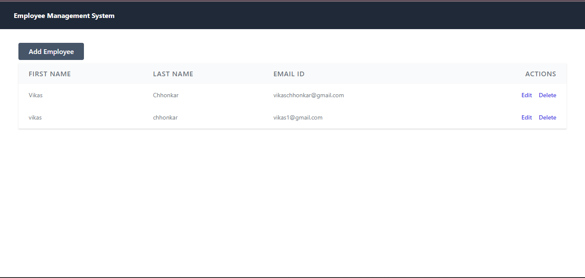
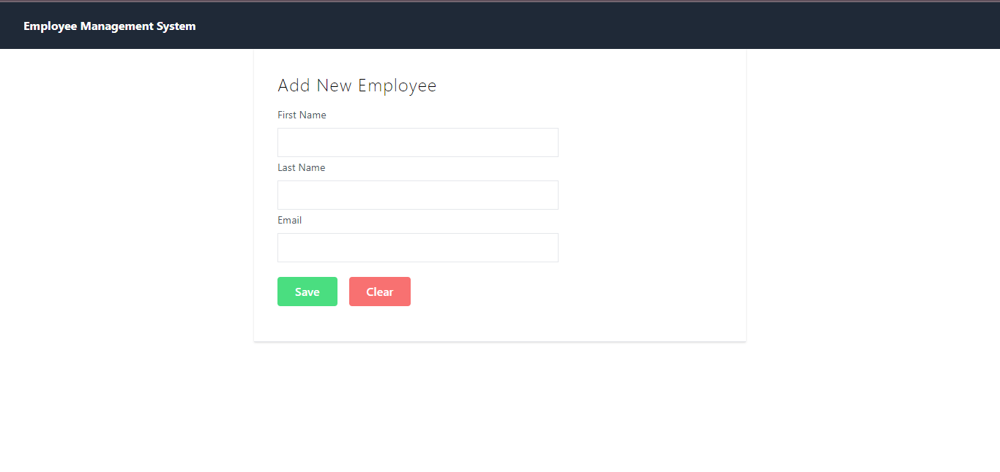
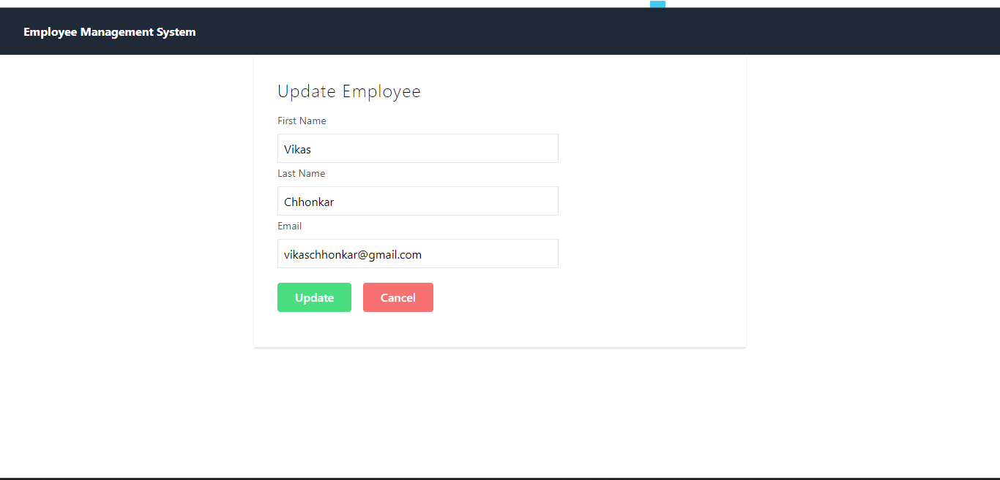

# Employee System

## About The Project

The Employee System is a full-stack web application built to manage employee records efficiently. It provides various CRUD (Create, Read, Update, Delete) operations for managing employee information.

## Features

- Create, read, update, and delete employee records.
- User-friendly web interface built with React.js and styled with Tailwind CSS.
- Robust and secure backend powered by Spring Boot.
- Data storage and retrieval using MySQL database.

## Tech Stack

- Frontend:
  - _React.js_: A JavaScript library for building user interfaces, providing a responsive and interactive user interface.
  - _Tailwind CSS_: A utility-first CSS framework for styling the application's components and user interface.
  - _Axios_: A promise-based HTTP client for making API requests to the backend.

- Backend:
  - _Spring Boot_: A Java-based framework for building robust and scalable backend services.
  - _Spring Data JPA_: Part of the Spring Data project, it simplifies data access with Java Persistence API (JPA) and Hibernate.

- Database:
  - _MySQL_: An open-source relational database management system for storing employee data.

- Developement Tools:
  - _Eclipse_ : Integrated development environments (IDEs) for Java development.
  - _Visual Studio Code_: A lightweight code editor for working on React.js and JavaScript.
  - _Postman_: A tool for testing and documenting APIs during development.

## Screenshots

- All Employees Screen

- Add New Employee Screen 

- Update Employee Screen

